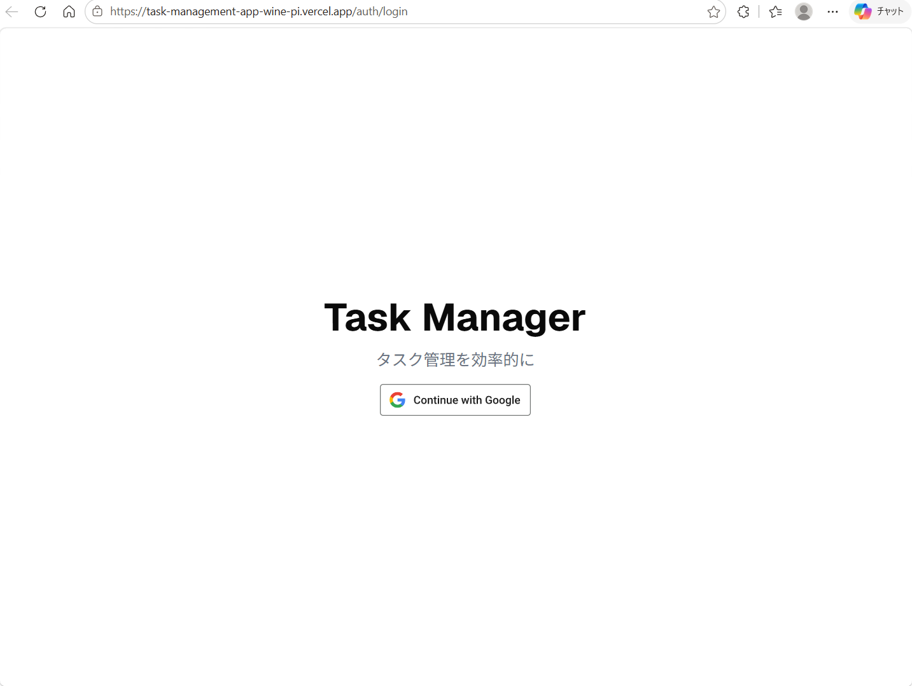
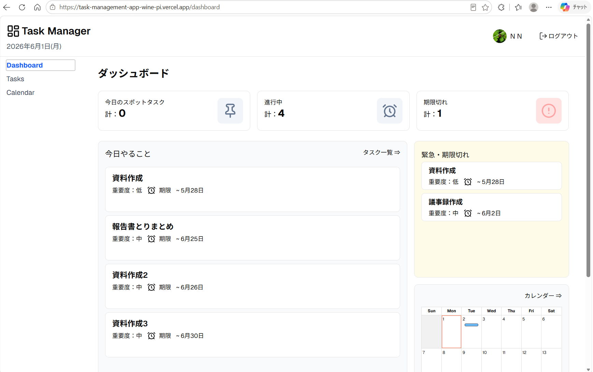
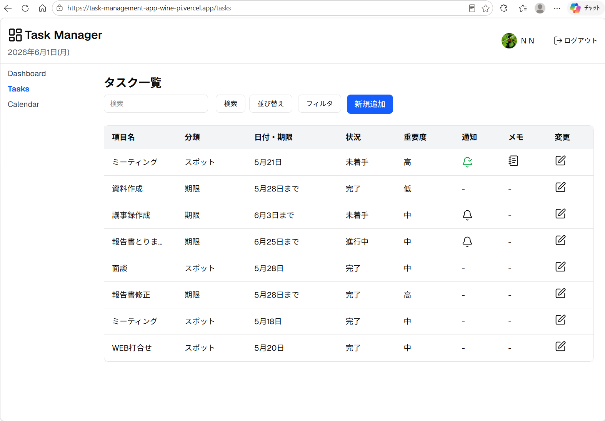
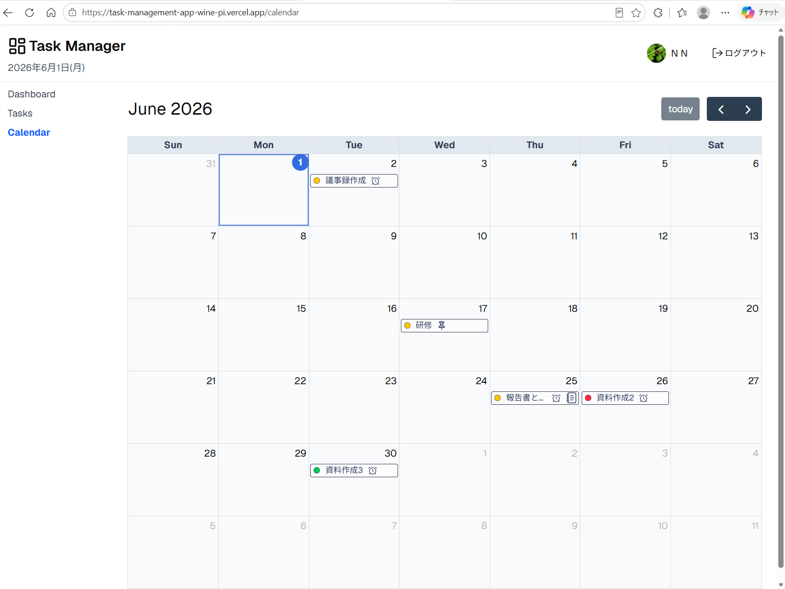

# Task Manager

Next.js / Supabase をベースに個人開発したタスク管理アプリ

## Getting Started

```bash
pnpm install
pnpm dev
```

http://localhost:3000 によりローカル環境でアプリを起動します。

## 使用技術

- Next.js
- React
- TypeScript
- Supabase
- PostgreSQL
- Tailwind CSS
- shadcn/ui
- FullCalendar
- Vercel
- Vercel Cron
- Resend

## 主な機能

- Supabase OAuthを用いたGoogle認証
- タスクをテーブル形式で管理
- データベース上でタスクを新規追加、編集、削除
- ステータス（未着手、進行中、完了）管理
- 重要度（低、中、高）管理
- ソート機能（日付、重要度）
- フィルタ機能（タスク分類、進行状況、重要度）
- タスク検索機能（文字列入力）
- ダッシュボードでのタスク集計
- ダッシュボードでの今日やるタスク、緊急・期限切れタスク一覧表示
- ダッシュボードでの簡易カレンダー表示
- カレンダー表示
- リマインドメール通知

##　スクリーンショット

### ログイン画面



### ダッシュボード



### タスク一覧



### カレンダー



##　工夫した点

- Supabase RLS によるユーザー毎のデータ分離
- スポット（当日限定）タスクと期限付きタスクの分類
- スポットタスクは当日まで未着手状態を維持するように
- ENUM による status / priority 管理
- Databaseを用いることによる型管理の一括化
- lucide iconとshadcn/uiを組み合わせたメモポップオーバー
- FullCalendarの導入＆連携
- Vercel CronとResendを組み合わせたリマインド通知
- SupabaseService Roleを用いてユーザーRLSとVercel Cronを両立
- レスポンシブ対応

## 今後の改善
